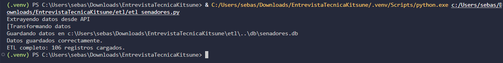
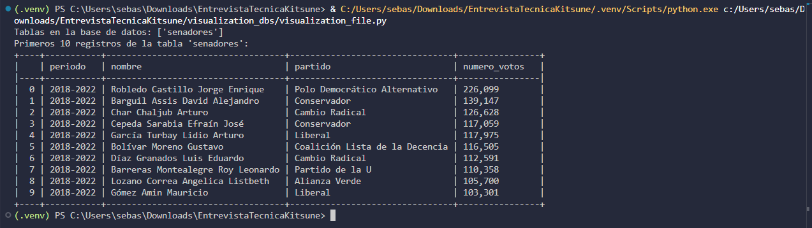
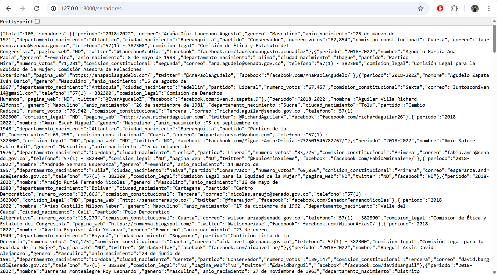
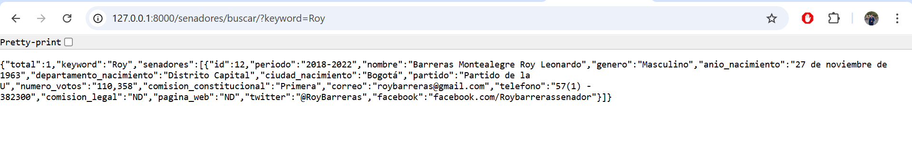
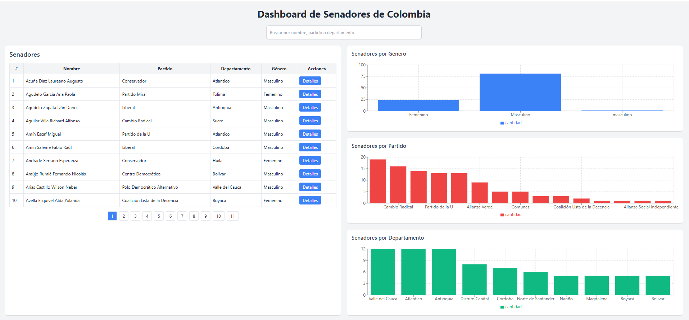
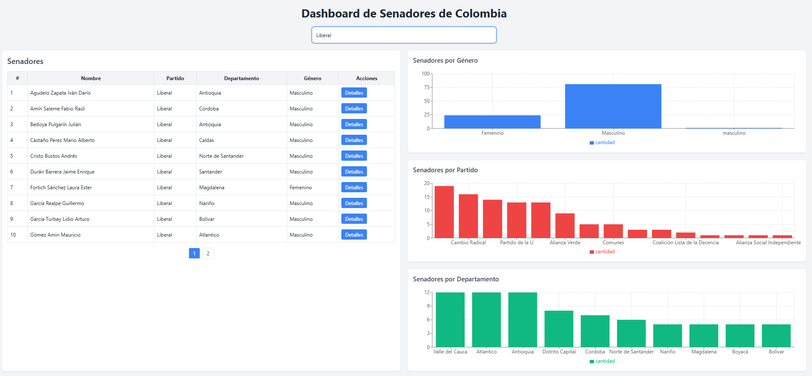
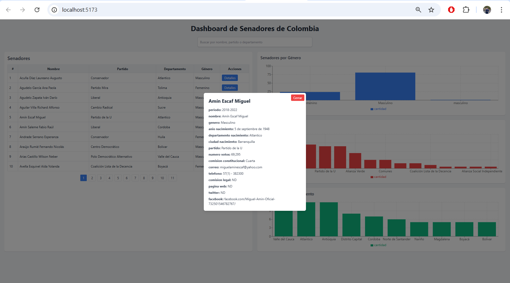

# Proyecto: API de Senadores de Colombia

Este proyecto consiste en extraer datos públicos de senadores de Colombia "https://www.datos.gov.co/Funci-n-p-blica/DIRECTORIO-DE-SENADORES-DE-LA-REPUBLICA/sjwx-dr6n/about_data" con la API que suministra la pagina de datos.gov.co, exponerlos mediante una API REST y visualizarlos en un frontend hecho en React.  

---

## Objetivo

- Validar la capacidad de **extraer datos públicos**, **procesarlos**, **exponerlos mediante una API** y **construir un frontend sencillo**, todo en un entorno local.

---

## Estructura del Proyecto

1. **etl/**: Contiene el script `etl_senadores.py` que realiza:
   - Extracción de datos desde una API pública de datos.gov.co.
   - Normalización de datos.
   - Carga en la base de datos local `db/senadores.db`.

2. **api/**: Contiene la API desarrollada en FastAPI.
   - Endpoints principales:
     - `GET /senadores`: Listar todos los senadores.
     - `GET /senadores/{id}`: Consultar senador por ID.
     - `GET /senadores/buscar/?keyword=`: Buscar por palabra clave.
     - `GET /senadores/estadisticas/`: Obtener estadísticas agregadas.
   - Permite filtrar por partido político y limitar la cantidad de registros.
   - Se hizo uso de Inteligencia Artificial porque se tuvo un problema cargando la API por unas columnas las cuales no estaban trayendo correctamente el encabezado y generaba error el código

3. **frontend/**: Aplicación en React que:
   - Consume la API para mostrar los datos en una tabla.
   - Permite buscar por palabra clave.
   - Muestra detalles de cada senador al seleccionarlo.
   - Se uso IA para el diseño de cards y hacer la tabla con numeración mostrando de a 10 registros, tambien se usó para poner las gráficas al lado derecho de forma rapida y estética.

4. **db/**: Contiene la base de datos SQLite `senadores.db`.

---

## Requisitos

- Python 3.10+
- Node.js 18+
- npm 9+
- SQLite

---

## Instalación y ejecución local

### 1. Ejecutar el ETL
Desde la carpeta raíz:

python etl/etl_senadores.py

### 2. Ejecutar la API

Desde la carpeta api/:

pip install -r requirements.txt
uvicorn main:app --reload --host 127.0.0.1 --port 8000

La API estará disponible en: http://127.0.0.1:8000/

### 3. Ejecutar el frontend

Desde la carpeta frontend/:

npm install
npm run dev

El dashboard estará disponible en: http://localhost:5173

## Diseño del proyecto

**ETL:**
 - Se centraliza en etl/etl_senadores.py.
 - Extrae datos de la API pública, normaliza campos y los guarda en SQLite.

**API REST (FastAPI):**
- Facilita la consulta de los datos.
- Permite filtrado, búsqueda y estadísticas.
- CORS configurado para consumir desde el frontend local.

**Frontend:**
- Consume la API.
- Tabla interactiva con búsqueda y detalles de senadores.
- Diseño simple y responsivo.

**Endpoints de ejemplo**

http://127.0.0.1:8000/senadores → Listar todos

http://127.0.0.1:8000/senadores/1 → Consultar por ID

http://127.0.0.1:8000/senadores/buscar/?keyword=Gustavo → Buscar por nombre

http://127.0.0.1:8000/senadores/estadisticas/ → Obtener estadísticas
